---

Typora 理论多版本兼容破解方案：https://www.52pojie.cn/thread-1710146-1-1.html

Linux 下的 Typora 安装和激活：https://seektao.cc/archives/typora-install-activation

【惊奇软件】Typora 1.10.8( 修改版) - Markdown编辑器 - 果核剥壳：https://www.ghxi.com/typora.html

---

### 如果您觉得本工具对您有帮助，不妨在右上角点亮一颗小星星，以示鼓励！

---

# 激活说明
* 如遇到激活或更新错误，请打开左上角 文件→偏好设置→通用→Typora服务使用国内服务器，然后重启Typora。

---

# 关于最新版本

### 建议支持官方正版或停留在 1.9.5 版本并关闭自动检查更新。

* 2025年02月21日 亲测 Typora 官网 1.10.6 最新版已无法激活
* 2025年03月05日 亲测 Typora 官网 1.10.8 最新版已无法激活

### 请打开左上角 文件→偏好设置→通用→更新→把 自动检查更新 和 更新至开发版 前面的勾去掉。

---

打开蓝奏云网盘，输入密码：1234 点确认。
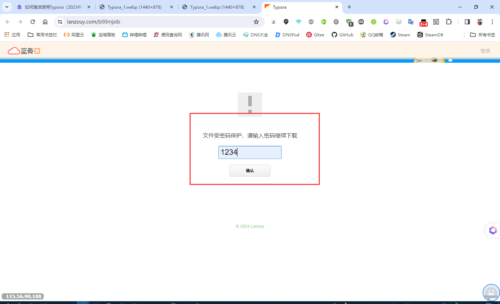

---

以 Windows 版为例
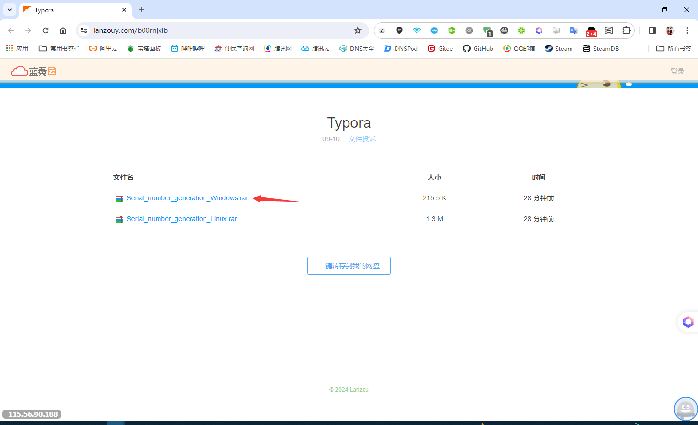

---

选择普通下载即可
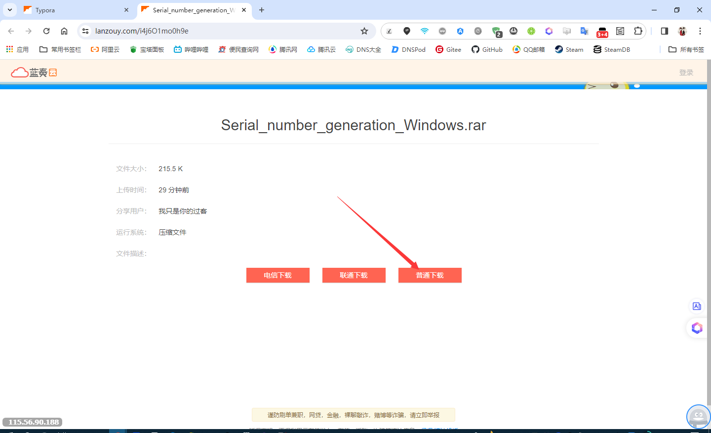

---

将下载好的压缩包文件解压后得到的 node_inject.exe 和 license-gen.exe 文件
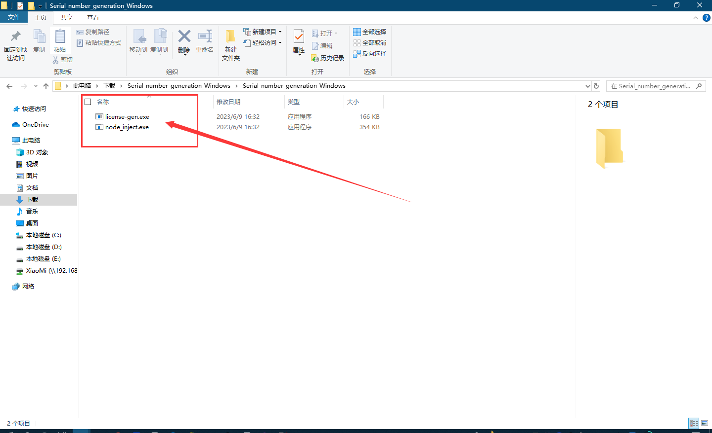

---

复制粘贴到Typora的安装目录
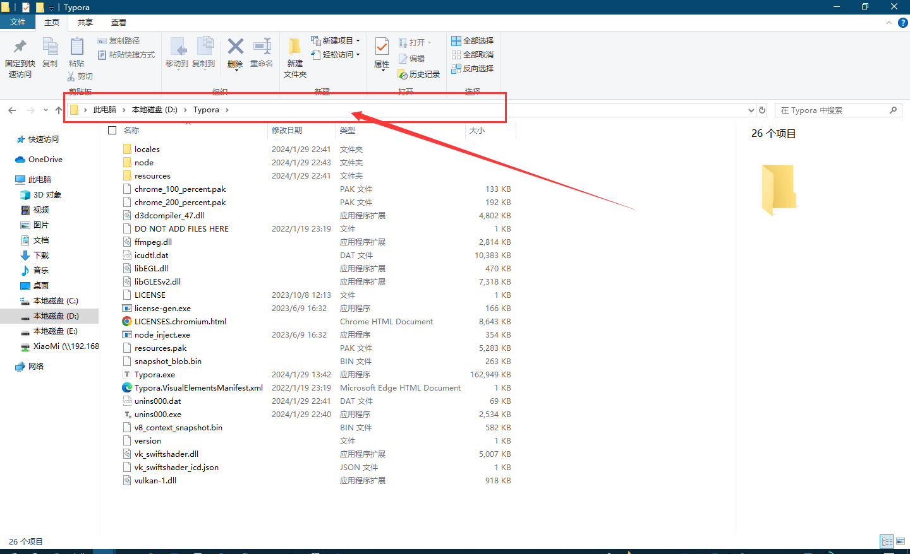

---

在 Typora 安装目录的地址栏输入 cmd 后，按 Enter键
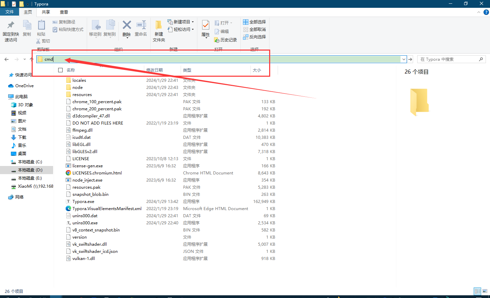

---

输入 node_inject.exe 按 Enter键 即可自动处理，然后输入 license-gen.exe 按 Enter键 即可得到序列号。
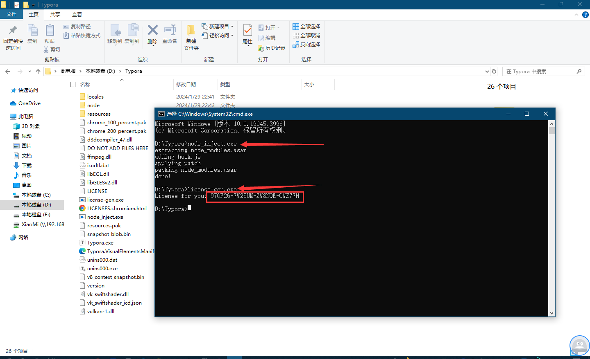

---

鼠标移动至序列号上双击鼠标左键，然后按一下鼠标右键或同时按住 Ctrl+Shift+C 键即可复制序列号。
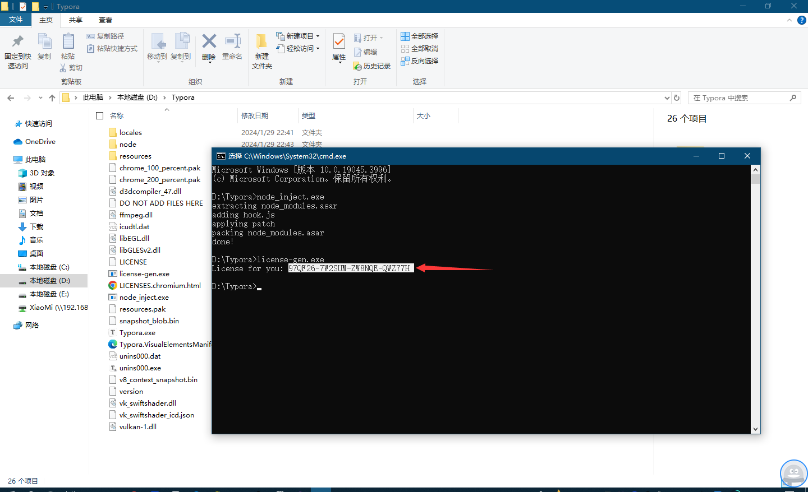

---

打开 Typora 点击：输入序列号
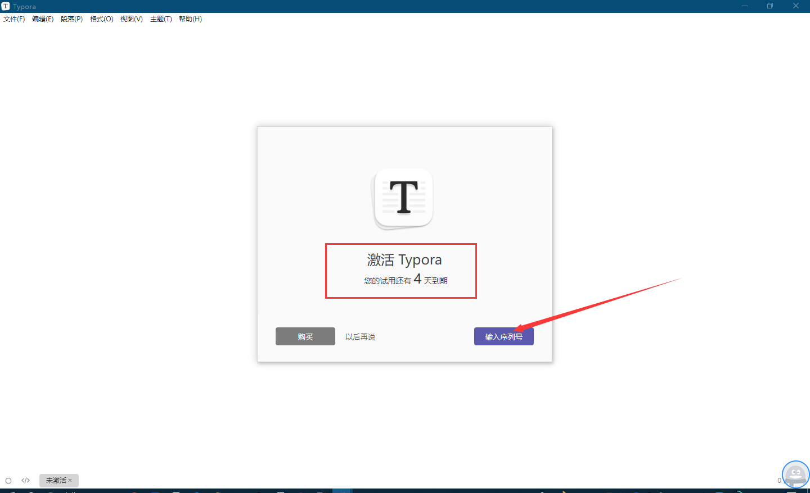

---

邮箱地址随意输入即可，然后输入刚才复制的序列号后点击：激活
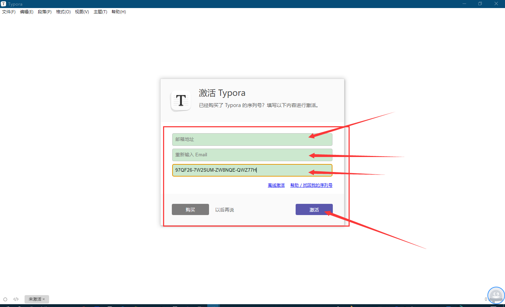

---

然后就会看到 Typora 已激活
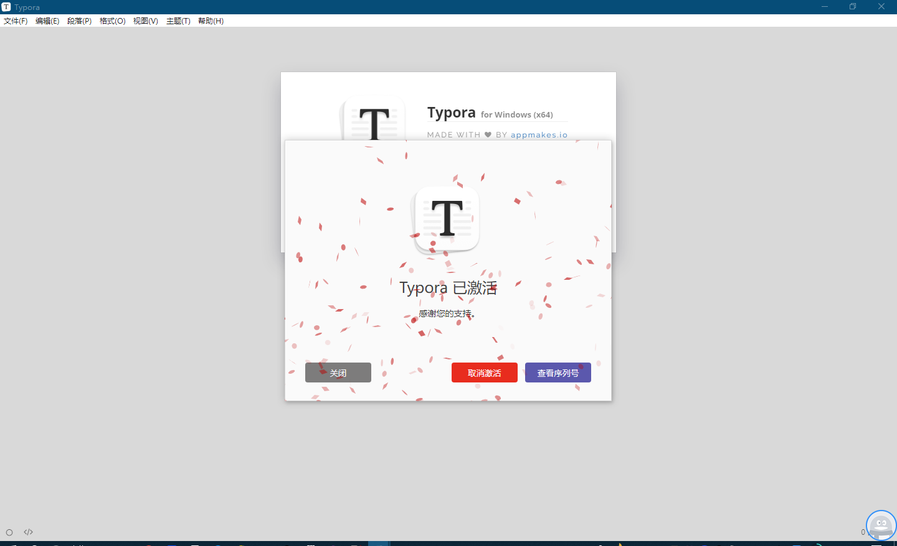

---

# 注意事项
* 旧版本Typora升级最新版本Typora需要先卸载旧版本Typora后，重新安装最新版本Typora才可以进行后续激活步骤。

---

# 尊重知识产权,使用正版软件!
* 尊重知识产权是每个人的责任和义务。请在合法合规的前提下使用本补丁，并支持正版软件的开发和维护，“请于24h内删除”。

---

# 免责声明
* 本补丁并非由 Typora 软件的原作者或开发团队制作，而是由第三方开发者编写。我们仅负责将该补丁分享给有需求的用户，对其具体功能和安全性不作任何保证。
* 使用本补丁可能对 Typora 软件的正常使用造成影响，甚至可能引发系统兼容性问题或其他不可预知的后果。用户在使用本补丁时应自行承担风险，并确保其计算机系统和数据的安全。
* 本补丁不提供任何形式的技术支持。用户在使用过程中遇到的任何问题，应自行解决或联系 Typora 的官方技术支持。
* Typora 软件及其所有相关知识产权归其原作者所有。本补丁的分享和使用均应尊重和保护原作者的版权。
* 用户在使用本补丁时，必须遵守所有适用的法律法规，包括但不限于版权法、计算机软件保护条例等。

---
